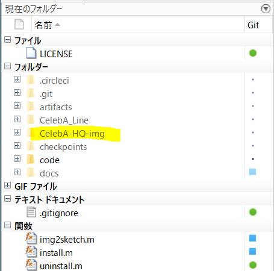
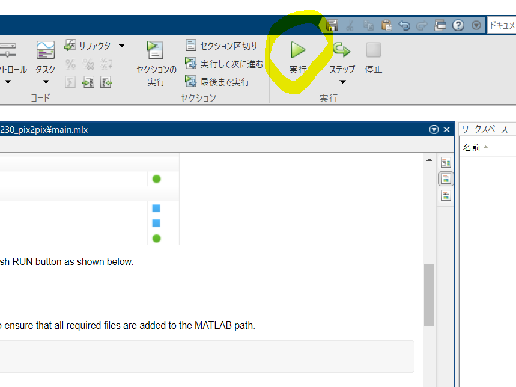

# sketch2im using Conditional GAN (pix2pix) 

This script shows how to reconstruct face images from their sketch-like image using pix2pix that is a kind of conditional GAN. 

This code is created based on [https://github.com/matlab-deep-learning/pix2pix.](https://github.com/matlab-deep-learning/pix2pix.) 

# Preparation

Fisrt of all, please download CelebAMask-HQ dataset. CelebAMask-HQ is a large-scale face image dataset that has 30,000 high-resolution face images selected from the CelebA dataset. 

[https://github.com/switchablenorms/CelebAMask-HQ](https://github.com/switchablenorms/CelebAMask-HQ)

To download the dataset, the following sites are available; 

   -  Google Drive: [downloading link](https://drive.google.com/open?id=1badu11NqxGf6qM3PTTooQDJvQbejgbTv) 
   -  Baidu Drive: [downloading link](https://pan.baidu.com/s/1wN1E-B1bJ7mE1mrn9loj5g) 

After downloading `CelebA-HQ-img`, put the file in the current path like below. 



After the installation,please push RUN button as shown below. 



# Installation

Run the function `install.m` to ensure that all required files are added to the MATLAB path.

```matlab:Code
clear;clc;close all
install();
```

# Create sketch-like images

Run the function `img2sketch.m` to convert the face images into skech-like ones. Then, the folder "CelebA_Line" should be created now. 

```matlab:Code
img2sketch()
```

# Training the model

To train a model you need pairs of images of "before" and "after", which correspond to `CelebA-HQ-img` and `CelebA_Line`, respectively now. 

```matlab:Code
labelFolder='CelebA_Line';
targetFolder='CelebA-HQ-img';
```

We can tune the training parameters as below. 

```matlab:Code
options = p2p.trainingOptions('MaxEpochs',1,'MiniBatchSize',8,'VerboseFrequency',30);
```

Note training the model will take several hours on a GPU and requires around 6GB of GPU memory.

```matlab:Code
p2pModel = p2p.train(labelFolder, targetFolder, options);
```

# Generating images

Once the model is trained we can use the generator to make generate a new image. 

```matlab:Code
exampleInput = imread('./CelebA_Line/1355.jpg');
exampleInput = imresize(exampleInput, [256, 256]);
```

We can then use the `p2p.translate` function to convert the input image using trained model.

```matlab:Code
exampleOutput = p2p.translate(p2pModel, exampleInput);
figure;imshowpair(exampleInput, gather(exampleOutput), "montage");
```

*This is the modified code formed from *[https://github.com/matlab-deep-learning/pix2pix](https://github.com/matlab-deep-learning/pix2pix)* by Kenta Itakura*
