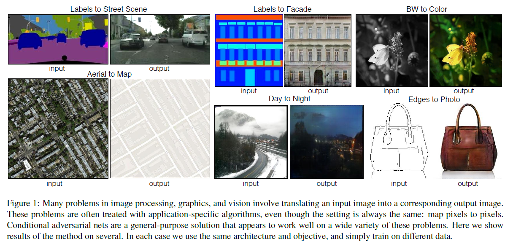
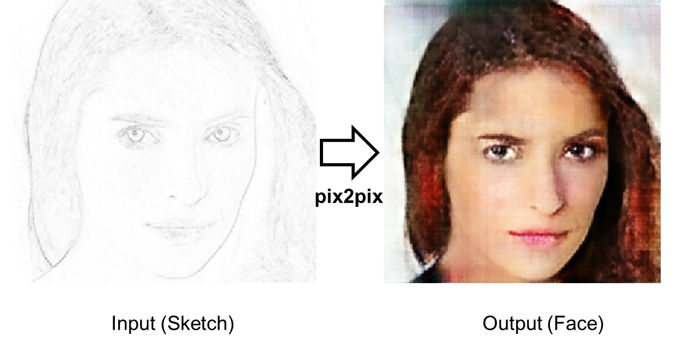
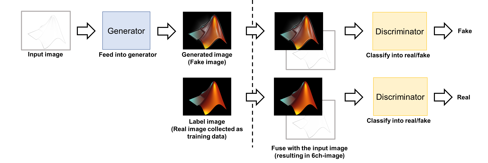
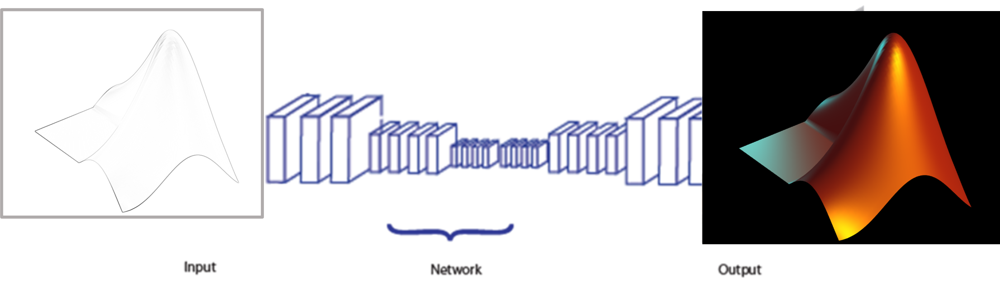
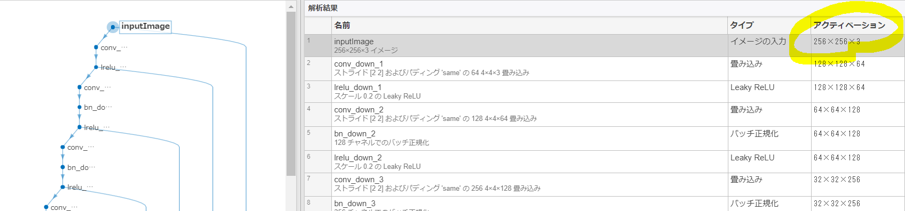
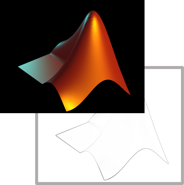
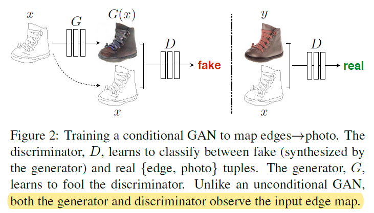
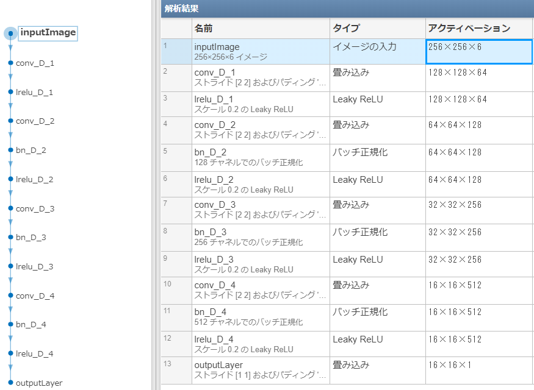
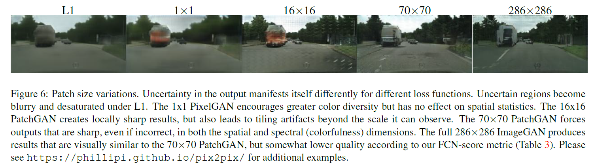

# pix2pixを勉強＆線画から顔画像を生成してみた：前半
# はじめに

この記事では、pix2pixについて勉強したのでそのまとめと、線画から画像に変換する課題にpix2pixを適用してみようと思います。pix2pixは以下の論文です。間違いなどがあれば教えていただけますと幸いです。

[Isola, P., Zhu, J.Y., Zhou, T. and Efros, A.A., 2017. Image-to-image translation with conditional adversarial networks. In Proceedings of the IEEE conference on computer vision and pattern recognition (pp. 1125-1134).](https://openaccess.thecvf.com/content_cvpr_2017/html/Isola_Image-To-Image_Translation_With_CVPR_2017_paper.html)

pix2pixの論文の冒頭で、それを試した時の入力と結果の例があります。以下は、論文の図１からの引用です。ラベルから風景に変換したりするだけでなく、線画や時間帯などを変換した例があり、いろいろなシーンで使えそうですね。この手法では、深層学習やGANと呼ばれる手法を用いていて、一対一対応する、画像とラベルのペアを用いて学習を行います。

図出展：Isola et al (2017)

  

pix2pixを勉強するうえで、顔の線画から顔の画像に変換することを試しに行ってみました。前半ではpix2pixについて述べ、後半ではこのデモについて紹介します。

  
# GANについて

pix2pixはGANの一種で、画像の生成器だけでなく、もとの（正解の）画像と生成した画像が生成したものか、もともと用意した画像かどうかを判別します。GANについては、ここでは割愛いたします。以下の記事などがわかりやすかったです。ただ、pix2pixに関しては、以下の内容から始めても問題ないのではと思います。

[https://jp.mathworks.com/help/deeplearning/ug/train-generative-adversarial-network.html](https://jp.mathworks.com/help/deeplearning/ug/train-generative-adversarial-network.html)

[https://ledge.ai/gan/](https://ledge.ai/gan/)

# pix2pixについて
## 大まかな流れ

以下の図はpix2pixの流れを簡単にまとめたものです。

   -  訓練データ：入力するデータ（例：線画）とその結果（例：線画のもとになってる画像）のペア 
   -  Generatorは入力画像（例：線画）からそれに対応する正解（例：線画のもとになってる画像）を生成することを目指す 
   -  Discriminatorは、その画像が生成されたものか、もともと用意している正解画像かを見分ける 
   -  Generatorは、正解画像とできるだけ同じ画像を生成できるよう学習していく 
   -  Discriminatorは、生成画像をFake, そうでない画像をRealと判別できるよう学習していく 

## 生成器（ジエネレーター）について

後半のデモで、線画の変換を行うので、ここでも線画っぽい絵を例にします。以下の左の図を右の図に変換することを考えます。ジェネレーターは畳み込み込みや逆畳み込みを用いて画像から画像の変換を行います。pix2pixでは、Unet構造を用います（以下の図ではそうなってませんが）。

Unetの構造に関しては以下の記事がわかりやすかったです。

https://qiita.com/koshian2/items/603106c228ac6b7d8356

  

  

下の図は、後半のデモで用いるネットワークを可視化したものです。入力は縦横が256×256で、チャンネル数は3（RGB）になっています。グレースケール画像なので、チャンネルを１にすることも可能ですが、特にそのような変更は行っていません。ジェネレーター側は、画像から画像を生成しているんだなという理解でひとまず良いと思います。また下の構造をみると、確かにスキップコネクションのような線が下に伸びていることもわかります。

  

  
# 識別器（ディスクリミネーター）について

上の流れの図でもありましたが、識別側では、生成されたであれば、Fake、もともと用意した画像ならRealと予測するように学習していきます。単純にCNNで分類するのもよいですが、pix2pixでは、入力の画像と生成された（又は正解画像）をチャンネル方向に重ねてから分類を行います。ちょうど下の図のようなイメージです。

論文では以下の図で説明されています。

  

実際にネットワークの構造を見てみます。一番上の段をみると、入力の画像が6チャンネルになっていることが確認できます。

  

また、上の図の最後の段を見ると、16×16×1になっています。Real / Fakeの見極めであればサイズは1であれば良さそうですが、pix2pixの論文では`PatchGAN`というセクションがあります。そこでは、以下のことが述べられています

   -  L1やL2損失のみを用いてimage-to-image変換をしようとすると全体的にぼやけた画像が生成されやすい 
   -  （ぼやけていないところである）高周波成分をうまく識別器が捉えるべく、識別側に工夫を加える 
   -  画像をパッチに分けて、その領域ごとに Real / Fakeか見分ける 
   -  特に識別器の構造を作り変えるわけではない 

確かに、高周波成分をうまく捉えて、ぼやけた生成画像を認識することができたら、より鮮明な画像が生成できそうです。その方策として、以下のように述べられています。

> We run this discriminator convolutionally across the image, averaging all responses to provide the ultimate output of D.

ここで、重要なのが先ほどの識別器の出力サイズで、16×16になっていると述べました。画像全体に対して、1つの出力（Real / Fake）を出すのではなく、各パッチごとにその推論を行います。このように出力を調整すれば、ちょうど各パッチごとに推論していることと等しいことを行うことができます。損失の計算では、各パッチの損失をそれぞれ計算し、足し合わせます。

　下の図は、パッチのサイズを変えたときの結果です。16×16の時が最もよかったとのことです。パッチサイズが大きいほど、細かいところまで見れるので良さそうですが、大きすぎると画像の全体的な良さを評価できないというトレードオフの関係にあります。複数のステージを設けて、複数のパッチの平均でもよさそうですね。

## ノイズベクトルｚについて

GANを勉強し始めると、ノイズベクトルｚというのをはじめに目にすると思います。そのｚを起点に生成したり、そのノイズベクトルによって生成する画像をある程度制御できたりします。しかし、pix2pixでは、ノイズベクトルｚに関しては以下のように書かれています。

 > Instead, for our final models, we provide noise only in the form of dropout, applied on several layers of our generator at both training and test time.

つまり、dropout層によって、ランダムに出力を落としてランダム性を加えていると述べられています。また、ここでは、**テストの段階でもドロップアウトを用いる**とあります。そのため、たとえばDCGANに出てくるノイズベクトルｚを思い浮かべながらpix2pixをみると少し違和感があるかもしれません。

## 損失について

pix2pixでは、入力と出力のペアの訓練画像があります。生成器の損失としては、出力の画像と生成画像の差分をとって（L1）、それらの差異も損失に加えます。

  
# 前半まとめ

   -  pix2pixの流れや方法についてまとめました 
   -  Conditional GANの一種ではあるものの、ノイズベクトルｚを明示的には使わず、入力の画像から目的の画像に変換するよう設計されていることがわかりました。 
   -  論文のイントロダクションにもあるとおり、多くのコンピュータービジョンのタスクは画像の何らかの変換、というふうに言い換えることができて、そのような課題一般にpix2pixを応用することができます。汎用性の高い非常に便利な手法だと思いました。 
   -  また、画像だけでなく、シミュレーションの結果とも合わせて変換をするような研究もあり（以下のPDF）、画像に留まらず、音の生成などでも使えるかもしれないですね 

[https://www.jstage.jst.go.jp/article/pjsai/JSAI2019/0/JSAI2019_4K3J1302/_pdf](https://www.jstage.jst.go.jp/article/pjsai/JSAI2019/0/JSAI2019_4K3J1302/_pdf)

  

後半では、顔画像のデータセットから線画を作成し、訓練させ、線画から顔画像を生成するpix2pixのモデルを作成しました。以下のようになっていて、上手く顔画像の生成ができました。しかし、少し文量が多くなったため、次回に回そうかと思います。
